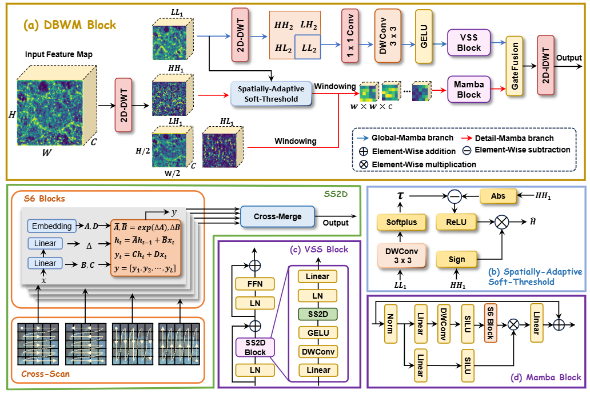

<div align="center">

# WM-DETR: Dual-Branch Wavelet-Mamba and Sparse Attention for Robust Underwater Object Detection

[]()
[]()
[]()
[]()


</div>

# Introduction

This repository presents **WM-DETR**, a robust underwater object detection framework that integrates **wavelet-based frequency decomposition**, state-space modeling (Mamba), and sparse adaptive interaction.Underwater detection is severely affected by light attenuation, scattering noise, color distortion, low contrast, and small objects. WM-DETR addresses these challenges by decomposing visual features into frequency sub-bands and modeling them using dual-branch state-space representations.Our framework improves detection robustness by suppressing background noise while preserving fine structural details, achieving strong performance on challenging underwater benchmarks.


---

# Quick Start

## 1. Dataset Preparation

### Download Dataset
#### (1) DUO dataset (https://github.com/chongweiliu/DUO)
#### (2) RUOD dataset (https://github.com/dlut-dimt/RUOD))

### Dataset Structure

Please download and organize the datasets with the following structure:

```text
datasets/
├── DUO/
│   ├── images/
│   │   ├── train/
│   │   └── val/
│   ├── labels/
│   │   ├── train/
│   │   └── val/
│   └── DUO.yaml
│
└── RUOD/
    ├── images/
    │   ├── train/
    │   └── val/
    ├── labels/
    │   ├── train/
    │   └── val/
    └── RUOD.yaml
```

### Configuration File

Use `datasets/data_RUOD.yaml` to configure the dataset path. An example is shown below:

```yaml
path: ./datasets/RUOD   # dataset root directory
train: images/train
val: images/val
nc: 5                                   # number of classes
names: ['holothurian', 'boat', 'echinus', 'starfish', 'fish', 'corals', 'diver', 'cuttlefish', 'turtle', 'jellyfish']
```

## 2、Pretrained Weights

You can download the pretrained weight file **`rtdetr-r50.pt`** from Baidu Netdisk:

- **Link**: [https://pan.baidu.com/s/1-yge3B-41eaUIiQOyxs0FQ](https://pan.baidu.com/s/1-yge3B-41eaUIiQOyxs0FQ)
- **Extraction Code**: `PKGR`
- 
After downloading, please place the weight file in the appropriate directory before training or evaluation.

## 3. Model Training

```bash
# Basic training command (using default configuration)
python3 ./train.py


